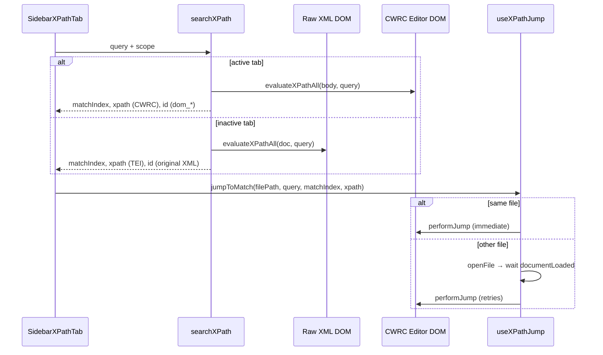

# XPath sidebar — planning & debug notes

**Status:** Partially shipped, **cross-file jump/highlight still broken** (March 2026)  
**Scope:** Desktop app sidebar XPath tab (`Explorer | Find | XPath`)

---

## What we built

The single-purpose project sidebar was replaced with three tabs. The **XPath** tab provides inline search (no modal dialog on desktop):

- Query field + scope dropdown: **Current file**, **Open tabs**, **Project**, **Custom**
- Results grouped by file, collapsible
- Each result shows the **xpath path** in monospace (no repeated tag label)
- Arrow-key navigation through results; Enter to jump
- Click/arrow jump should highlight the element in the WYSIWYG editor **without stealing focus** from the sidebar
- Toolbar XPath button hidden on desktop (web dialog unchanged)

### Key files

| File | Role |
|------|------|
| `apps/commons/src/desktop/ProjectSidebar.tsx` | Tab shell |
| `apps/commons/src/desktop/sidebar/SidebarXPathTab.tsx` | XPath UI + keyboard nav |
| `apps/commons/src/desktop/xpath/searchXPath.ts` | Multi-scope search orchestration |
| `apps/commons/src/desktop/xpath/evaluateXPathAll.ts` | Raw XML xpath evaluation + path building |
| `apps/commons/src/desktop/xpath/useXPathJump.ts` | Open tab, wait for editor, select node |
| `apps/commons/src/desktop/xpath/teiXPathWalker.ts` | Walk editor DOM by `_tag` to match stored TEI xpath |
| `packages/cwrc-leafwriter/src/js/conversion/xml2cwrc.ts` | XML → editor HTML conversion (strips original `id`) |
| `packages/cwrc-leafwriter/src/js/utilities.ts` | `selectNode`, `getElementXPath`, `evaluateXPathAll` |

---

## What works

| Feature | Status |
|---------|--------|
| Tabbed sidebar (Explorer / Find stub / XPath) | Done |
| XPath search across four scopes | Done |
| File-grouped, collapsible results | Done |
| Results show xpath path only | Done |
| Keyboard nav + highlight **in the active file** | Confirmed working |
| Sidebar keeps focus after jump (`focusEditor: false`) | Done |
| Tab content caching (`editorReady` on open tabs) | Done |
| Toolbar XPath hidden on desktop | Done |

---

## What is still broken

| Feature | Status |
|---------|--------|
| **Cross-file jump** — switching tabs when selecting a result in another file | Unreliable / regressed during debug |
| **Cross-file highlight** — element selection in editor after tab switch | Not working |
| Debug instrumentation logs | Fetch to local debug server did not produce log files in Electron (instrumentation unverified) |

User-reported behaviour at time of writing:

1. Earlier: tab switched but wrong/no highlight in the other file.
2. After ref-based “fixes”: **tabs stopped switching entirely**; user stayed on one file with no highlight.
3. v8 fix reverted ref pre-setting and uses React state for `isActive`; **still broken** at last check.

---

## Core problem: two different DOM trees

Search and jump operate on **different representations** of the same document depending on scope and which tab is active.

### Search phase

```
Open tabs scope
├── Active tab  → searchInEditor()     → editor body (CWRC / TinyMCE DOM)
└── Other tabs  → searchInXmlContent() → raw XML via DOMParser
```

For inactive tabs, results come from **raw XML**. Each match stores:

- `matchIndex` — position in the raw XML xpath result list
- `xpath` — path built by `getXPathForElement()` (e.g. `/TEI/text/body/div[1]/p[3]`)
- `id` — original XML `id` attribute (only when searching the active editor)

### Jump phase

Jump always targets **`window.writer.editor.getBody()`** — the CWRC editor DOM, which is **not** the same tree as raw XML.

---

## Root causes (confirmed by runtime logs, earlier debug session)

### 1. XML `id` values do not survive conversion

In `xml2cwrc.ts`, original `id` attributes are **removed** and replaced with generated `dom_*` ids:

```typescript
node.removeAttribute('id');
const id = this.writer.getUniqueId('dom_');
// ...
openingTagString = `<${htmlTag} _tag="${nodeName}" id="${id}" ...`;
```

**Evidence:** Jump to file B failed with `hasId: true`; id lookup in editor body found nothing.

**Implication:** `selectElementById(storedId)` cannot work for results from raw XML search. We stopped relying on ids for inactive-tab results, but the jump code still tries id first if present.

### 2. `matchIndex` is not portable across raw XML and editor DOM

The same xpath query (`//p`) can return the same *logical* matches but in a **different order or count** in raw XML vs the converted editor body (wrapper elements, schema normalization, etc.).

**Evidence:** File A jump via `matchIndex` succeeded on the active file. File B jump via `matchIndex` selected the wrong node or failed.

**Implication:** `matchIndex` from search is only trustworthy when `searchInEditor()` was used for that file.

### 3. Stored xpath path is the right *idea*, but mapping is hard

The stable identifier across conversion is the **TEI element path** (tag names + sibling indices), not id or flat index.

Editor elements carry `_tag="${nodeName}"` (full name, may include namespace prefix e.g. `cb:div`).

Raw xpath from search uses `nodeName` segments (e.g. `/TEI/text/body/cb:div[2]/p[4]`).

We added `teiXPathWalker.ts` to walk the editor DOM by `_tag` along stored segments. This is the correct direction but:

- Has not been verified end-to-end (syntax error blocked compilation for a period; logs never captured success).
- Sibling indices may still diverge if xml2cwrc adds/removes/reorders nodes.
- Namespace handling (`cb:div` in xpath vs `_tag="cb:div"`) needs explicit testing.

### 4. Tab-switch timing and stale refs (implementation bugs)

Cross-file jump flow:

```
jumpToMatch → openFile(filePath) → setResource → loadDocumentXML → documentLoaded → performJump
```

Bugs introduced during debugging:

| Bug | Effect |
|-----|--------|
| Pre-setting `activeTabPathRef` to target file before `openFile` completed | Next jump thought tab was already active → **skipped `openFile`** → no tab switch |
| Guard that stopped syncing refs from React state while pending jump existed | Compounded stale path detection |
| `selectNode` “success” when any selection existed | False positive — old selection counted as successful jump |

v8 reverted ref pre-setting and uses `resource?.filePath ?? activeTabPath` for `isActive`. Outcome still broken — suggests remaining issues are in xpath mapping and/or timing, not refs alone.

---

## Search vs jump data flow (diagram)



---

## Jump strategy (current code)

`performJump` tries methods in order:

1. **id** — querySelector `#id` in editor (only works for active-tab editor search)
2. **teiWalk** — `findEditorNodeByTeiXPath(body, stored xpath)` via `_tag`
3. **selectNode** — CWRC xpath string (leading `/` stripped)
4. **evaluateXPath** — single-node xpath on editor body
5. **matchIndex** — `evaluateXPathAll(body, query)[matchIndex]` (fallback, unreliable cross-domain)

---

## Attempted fixes (chronological)

| Attempt | Intent | Outcome |
|---------|--------|---------|
| Jump by `id` | Fast lookup | Failed for raw XML results (ids stripped in editor) |
| Jump by `matchIndex` | Re-use search index | Works same-file only; wrong node cross-file |
| Store + jump by xpath string | Stable path across conversion | Implemented; teiWalk blocked by syntax error initially |
| `PendingXPathJump.xpath` + documentLoaded retry | Wait for editor before jump | Partial; timing/ref bugs interfered |
| Namespace-aware `matchesTeiTag` | Match `cb:div` ↔ `div` | Code written; not verified |
| Ref-based path tracking | Avoid path mismatch on tab switch | **Caused regression** — tabs stopped switching |
| v8: React state for `isActive`, retries after `openFile` | Fix regression | Still broken at last user test |

---

## Recommended next steps (prioritized)

### A. Fix the architecture mismatch (preferred long-term)

**Search inactive tabs in a representation that matches jump.**

Options:

1. **Search all open tabs via editor when possible**  
   After opening a tab once, cache editor-prepared xpath results per tab (not just `editorReady` content). Search uses CWRC paths for all open tabs.

2. **Search raw XML but jump via re-query on editor**  
   After tab switch + `documentLoaded`, run `evaluateXPathAll(editorBody, query)` and match results by comparing **normalized xpath strings** (or tag path suffix) rather than `matchIndex`.

3. **Store a jump key independent of index**  
   At search time in raw XML, store enough to disambiguate: full xpath + **text snippet** or **attribute fingerprint**; after load, find best match in editor results.

### B. Stabilize tab switching (short-term)

- [ ] Add unit/integration test for `jumpToMatch`: when `activeTabPath !== jump.filePath`, assert `openFile` is called.
- [ ] Remove debug fetch instrumentation; use `console.debug` or Electron main-process logging that actually persists.
- [ ] Clear `pendingJumpRef` on successful same-file jump (partially done in v8).
- [ ] Do not attempt id-based jump when result came from raw XML search (`includeIds: false` already set in `searchInXmlContent`; ensure jump respects this).

### C. Validate teiXPathWalker

- [ ] Unit tests with fixture HTML mimicking xml2cwrc output (`_tag`, sibling structure).
- [ ] Log `describeTeiXPathWalkFailure` output to console during manual test.
- [ ] Compare raw xpath segments vs editor `getElementXPath` for the same logical element on the **active** file (should match when tree is 1:1).

### D. Handle index divergence explicitly

If teiWalk fails at segment *i* with `candidateCount > 0` but wrong index:

- Try adjacent indices (off-by-one from conversion differences).
- Fall back to matching by xpath suffix (last N segments unique within file).

### E. Out of scope (for now)

- Find tab implementation
- Persisting last query/scope
- Removing legacy toolbar xpath dialog on web

---

## Manual test plan

Use two TEI files with many `//p` matches (e.g. project corpus files).

1. Open both files in tabs.
2. XPath tab → query `//p` → scope **Open tabs**.
3. **Same file:** arrow through results → editor highlights correct `<p>`, sidebar keeps focus.
4. **Cross file:** arrow/click result in the other file → tab switches, correct `<p>` highlights.
5. **Project scope:** repeat with files not yet open → should open tab then highlight.
6. DevTools console: look for `xpath-v8` debug messages if instrumentation remains.

---

## Open questions

1. Does xml2cwrc always preserve 1:1 element sibling order for TEI content, or are nodes merged/split?
2. Are xpath indices in raw XML (`getXPathForElement`) computed the same way as editor indices (`getElementXPath` with `_tag`)? They use different sibling-walking logic — this may explain teiWalk failures at deep segments.
3. Does `documentLoaded` fire reliably on tab switch when `editorReady` skips re-preparation?
4. Why did debug fetch logs never appear in `.cursor/debug-*.log`? (CSP, Electron network isolation, or reproduction not reaching instrumented paths?)

---

## Related prior art

The web **XPath Search dialog** (`packages/cwrc-leafwriter/src/dialogs/xpathSearch/`) searches only the **active editor body**. It does not have a cross-file problem. Desktop sidebar intentionally searches raw files for inactive tabs — that design choice created the mismatch.

---

## Summary

The sidebar XPath **search UI and same-file navigation work**. Cross-file jump/highlight fails because search results describe **raw XML** while jump targets the **converted editor DOM**. Original XML ids and match indices are not portable. The planned fix is xpath-path-based navigation via `_tag` walking, but implementation bugs (stale refs) caused a tab-switch regression, and the core walker has not been proven correct. Next work should either unify search and jump on the same DOM representation, or re-query the editor after load and match by xpath string rather than index.
