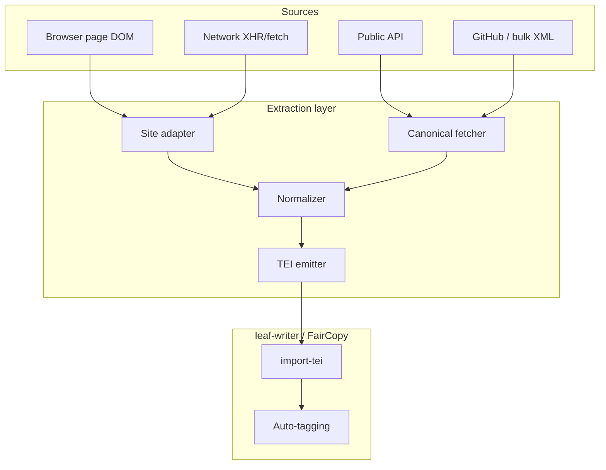

# Corpus extraction — planning

Status: **draft** (2026-07-05).  
**Consumer:** [LEAF/LJB](../) import path (TEI XML → editor → auto-tagging).  
**Related:** [Auto-tagging.md](Auto-tagging.md), [authority-extraction.md](authority-extraction.md).

This document plans a **corpus extraction** layer: tools that read text from online DH repositories (browser page, API, or bulk download) and produce **structured TEI** with metadata, paragraph boundaries, page breaks, and source pointers — ready for leaf-writer or FairCopy.

The primary deliverable is probably a **browser extension** (“Extract to TEI”), but the same adapter code should run headless (CLI, future leaf-writer “Import from URL”).

---

## Problem statement

Scholars routinely read pre-modern East Asian texts in web corpora (CTEXT, CBETA, Scripta Sinica, Kanripo, Wikisource, 識典古籍, BDRC, Aozora Bunko, NDL, …). Copy-paste loses:

- bibliographic metadata and stable identifiers  
- paragraph / section / juan structure  
- page breaks and image–text alignment  
- footnotes, variant characters, ruby, punctuation layers  
- licensing / attribution strings required by the host

We want a one-click (or URL-paste) path from **“what I’m reading in the browser”** to **“TEI snippet or file in my project”**, without re-keying.

---

## Design principles

1. **Canonical source beats rendered HTML.** When a corpus publishes TEI, XML, JSON, or GitHub files, fetch those — do not scrape `<div>` soup unless necessary.
2. **Stable ID in, stable TEI out.** Every export records `<idno type="URI">` (and corpus-specific ids) so the passage can be re-fetched or cited.
3. **One intermediate model, many adapters.** Site-specific code produces a shared `ExtractedDocument`; one TEI emitter handles leaf-writer handoff.
4. **Loss is explicit.** If page breaks or notes cannot be recovered from the chosen path, the export metadata says so (`<note type="extraction">`) — never silent degradation.
5. **Normalization once.** NFC at export time; CJK whitespace policy aligned with [Auto-tagging.md](Auto-tagging.md) (`ignore` default for `zh`/`ja`/`bo`/`lzh`).
6. **Legal posture: personal research + attribution.** Each adapter ships with corpus terms summary; bulk redistribution stays on the corpus’s own open-data channels.

---

## Architecture



### Intermediate model (`ExtractedDocument`)

All adapters target the same JSON shape (TypeScript types in the extension repo; not leaf-writer core until stabilized):

```json
{
  "source": {
    "corpus": "cbeta",
    "workId": "T0220",
    "url": "https://cbetaonline.dila.edu.tw/...",
    "retrievalMethod": "api | github | dom | network"
  },
  "metadata": {
    "title": "…",
    "titleLang": "zh-Hant",
    "author": "…",
    "juan": 1,
    "edition": "…",
    "language": "lzh"
  },
  "structure": [
    { "type": "pb", "n": "0001a", "facsimile": "…" },
    { "type": "head", "text": "…" },
    { "type": "p", "text": "…", "n": "1" },
    { "type": "note", "place": "foot", "text": "…" },
    { "type": "lb" }
  ],
  "warnings": ["page-breaks not available via DOM path"]
}
```

### Adapter interface

```typescript
interface CorpusAdapter {
  id: string;                          // e.g. "cbeta"
  match(url: URL): boolean;
  detectWorkRef(doc: Document, url: URL): WorkRef | null;
  preferCanonical?(ref: WorkRef): Promise<ExtractedDocument>;
  extractFromNetwork?(entry: NetworkEntry): ExtractedDocument | null;
  extractFromDom(doc: Document, url: URL): ExtractedDocument;
}
```

**Resolution order per page:**

1. Parse stable ID from URL / page meta / JSON-LD  
2. If `preferCanonical` exists and succeeds → use it  
3. Else intercept recent network payloads  
4. Else DOM scrape with site-specific selectors  
5. Attach `warnings` for anything inferred not read

### TEI emitter (minimal profile)

Target **TEI Lite + sourceDesc + pb/lb/note** — enough for FairCopy `import-tei.js` and leaf-writer validation:

- `<teiHeader>` with `<fileDesc><titleStmt>`, `<publicationStmt>`, `<sourceDesc><bibl>`  
- `<text xml:lang="…"><body>` with `<div type="chapter|juan">`, `<p>`, `<pb/>`, `<note place="foot">`  
- `<idno type="URI">` and corpus-specific ids (`@corresp` to CBETA work codes, CTP URNs, KR ids, BDRC `bdr:…`, Wikisource page ids)

Optional later: `<facsimile>` stub pointing at IIIF when the host exposes image URLs.

### Browser extension shape (Manifest V3)

| Component | Role |
|-----------|------|
| Content scripts | Per-domain DOM hooks; optional `webRequest`/debugger for XHR (where permitted) |
| Service worker | Adapter registry, fetch canonical sources, build TEI, download |
| Side panel / popup | Preview structure tree, warnings, “Export TEI” / “Copy” / “Open in leaf-writer” |
| Options | API keys (CTEXT), GitHub token (Kanripo), default language/whitespace policy |

**Future:** native messaging to leaf-writer desktop (same payload as file download).

---

## Source catalog

Priority tiers reflect **quality of structured access** and **overlap with leaf-writer user base**, not corpus size.

| Tier | Corpus | Language | Best access | Extension role |
|------|--------|----------|-------------|------------------|
| **P0** | CBETA | zh (Buddhist) | TEI P5 GitHub + [CBETA API](https://cbdata.dila.edu.tw/stable/static_pages/export) | ID from URL → fetch TEI |
| **P0** | CTEXT | lzh/zh | [CTP JSON API](https://ctext.org/tools/api) + [plugins](https://ctext.org/tools/plugins/ens) | URN from page → `gettext` |
| **P1** | Kanripo | lzh | [API v1](https://www.kanripo.org/api) + GitHub TEI/Mandoku | KR id → clone/fetch edition file |
| **P1** | Wikisource | multi | [MediaWiki Action API](https://www.mediawiki.org/wiki/API:Parsing_wikitext) | Page title → wikitext → TEI |
| **P1** | 識典古籍 Shidianguji | zh | DOM + network (no public bulk API yet) | Scrape / intercept; high user demand |
| **P2** | Scripta Sinica | zh | DOM only (subscription) | Scrape; institutional login caveat |
| **P2** | BDRC / BUDA | bo | [purl.bdrc.io](http://purl.bdrc.io/index) + etext chunks | `bdr:UT…` → etext graph |
| **P2** | OpenPecha / Pecha.org | bo | [pecha.org API](https://forum.openpecha.org/t/retrieving-buddhist-text-commentaries-using-pecha-org-api-a-step-by-step-guide/78), HuggingFace | Segment id → standoff layers |
| **P2** | Aozora Bunko | ja | [GitHub corpus](https://github.com/aozorabunko/aozorabunko) + XHTML files | Card id → fetch XHTML |
| **P2** | NDL Kotenseki / Next DL | ja/zh (koten) | [NDL Lab API](https://lab.ndl.go.jp/) + OCR JSON | Item id → text + coords |
| **P3** | NIJL / Kokusho DB | ja | [古典籍 DBs](https://www.nijl.ac.jp/pages/database/index.html), [open dataset](https://www.nijl.ac.jp/pages/cijproject/info/dataset.html) | DOI / bib id → bulk or API |
| **P3** | Japan Search | ja | Aggregator API | Resolve to provider adapter |
| **P3** | Adarsha / ALL | bo | Web reader; training data via BDRC OCR ecosystem | DOM; link to BDRC ids where possible |

---

## Per-source notes

### CBETA (Chinese Buddhist Electronic Text Association)

- **Canonical:** [cbeta-org/xml-p5](https://github.com/cbeta-org/xml-p5) (TEI P5); [CBETA TAFxml](https://github.com/DILA-edu/CBETA_TAFxml) for NLP-friendly simplification.
- **API:** [CBData](https://cbdata.dila.edu.tw/stable/static_pages/download_fulltext) — export by work/volume; TextRef CSV crosswalks.
- **Browser:** cbetaonline.dila.edu.tw / cbeta.org — URL encodes `T####` work codes and juan.
- **Extract:** Map URL → work id → fetch TEI slice (juan or `@xml:id` range). Preserve `<pb n="…"/>`, `<note>`, `<app>`, `<g>` (variant glyphs).
- **Copyright:** [CBETA copyright page](https://www.cbeta.org/copyright.php); attribute in `<publicationStmt>`.
- **Adapter difficulty:** Low (API-first).

### CTEXT (Chinese Text Project)

- **Canonical:** [CTP JSON API](https://ctext.org/tools/api) — `gettext(urn)` → `{ title, fulltext[], subsections[] }`.
- **URN:** Shown on each page (e.g. `ctp:analects/xue-er`); required for re-fetch.
- **Plugins:** CTEXT supports third-party export plugins via XML registration — alternative to a browser extension for CTEXT-only users ([plugin spec](https://ctext.org/tools/api)).
- **Python:** [`ctext`](https://pypi.org/project/ctext/) package for headless batch.
- **Extract:** `fulltext[]` → one `<p>` per paragraph; header from API title; `@xml:lang="lzh"`.
- **Auth:** Full book structure / large downloads need [API key](https://ctext.org/tools/api).
- **Adapter difficulty:** Low.

### Scripta Sinica (漢籍電子文獻 — Academia Sinica)

- **Access:** Institutional subscription; no public TEI dump.
- **Platform import:** [Academia Sinica DH Platform](https://dh.ascdc.sinica.edu.tw/member/index_en.html) can import 漢籍 texts for analysis — parallel path, not a substitute for TEI export.
- **Extract:** DOM adapter on hanji.sinica.edu.tw — title metadata from UI chrome, body from text pane; page/image refs when “圖文對照” exposes them.
- **Risks:** Layout changes; ToS on automated extraction; login/session handling for extension.
- **Adapter difficulty:** High (scrape-only, fragile).

### Kanripo (漢籍リポジトリ / Kanseki Repository)

- **Canonical:** GitHub editions in **TEI** or **Mandoku** format; [KanripoX manifest schema](http://kanji.zinbun.kyoto-u.ac.jp/~wittern/kkh/krpbasic/data/KRXManifest-2020-12-08.html).
- **API:** [v1.0 search/titles](https://www.kanripo.org/api) (JSON with `Accept: application/json`).
- **Tooling:** [pykanripo](https://github.com/mandoku/pykanripo) for GitHub workspace interaction.
- **Extract:** KR work id (e.g. `KR5c0126`) from URL → resolve edition manifest → fetch TEI juan files (XInclude assembly) or Mandoku token file.
- **Language:** `@xml:lang="lzh"` default.
- **Adapter difficulty:** Medium (GitHub + API; Mandoku parser if not TEI edition).

### Wikisource

- **Scope:** Language-specific wikis — `zh.wikisource.org`, `ja.wikisource.org`, `en.wikisource.org`, [multilingual hub](https://wikisource.org).
- **API:** MediaWiki Action API — `action=parse&prop=wikitext` or [Revisions API](https://www.mediawiki.org/wiki/API:Get_the_contents_of_a_page) for raw wikitext; [Special:Export](https://www.mediawiki.org/wiki/Help:Export) for XML dumps.
- **TEI:** No native TEI export ([Wikisource:TEI](https://wikisource.org/wiki/Wikisource:TEI) is aspirational). Community templates vary by language wiki.
- **Extract pipeline:** Page title → wikitext → strip / map templates (`{{header}}`, `{{pb}}`, `{{note}}`, `<noinclude>`) → `ExtractedDocument`. ja/zh Wikisource often mark page breaks with `[[Page:N]]` or custom templates — per-wiki template tables required.
- **Bulk:** [Wikimedia dumps](https://dumps.wikimedia.org/) for offline corpus builds (out of scope for extension MVP).
- **Adapter difficulty:** Medium–high (wikitext heterogeneity).

### 識典古籍 Shidianguji (ByteDance × PKU Digital Humanities)

- **Site:** [shidianguji.com](https://www.shidianguji.com/zh) — AI OCR, punctuation, NER, image–text sync, collation across editions ([PKU project page](https://pkudh.org/project/shidianguji/)).
- **Access:** Free web reader; **no published public API or bulk TEI** as of 2026.
- **Value:** High-quality transcriptions (标点, 校勘 notes) not available elsewhere for many titles.
- **Extract strategy:**
  1. DevTools reconnaissance: many SPAs load passage JSON via internal APIs — **network intercept** preferred over DOM.
  2. Capture: title, edition, chapter/juan, punctuated text, optional image page index, entity annotations if exposed.
  3. Map punctuation layer to TEI `<pc>` or plain `<p>` with `<note type="punct">` documenting machine punctuation.
- **Legal:** Operated by ByteDance; Peking University holds copyright on contributed 书影/data — attribute both; no bulk re-hosting.
- **Adapter difficulty:** High (reverse-engineer network; SPA churn).

### BDRC (Buddhist Digital Resource Center / BUDA)

- **Scale:** Largest archive of Tibetan Buddhist scans + growing etext corpus; manual transcription + OCR ([2026 open dataset initiative](https://www.bdrc.io/blog/2026/02/28/bdrc-launches-major-initiative-to-build-open-buddhist-datasets-for-ai/)).
- **API:** [BDRC Public Data Interface](http://purl.bdrc.io/index) — RDF/JSON-LD; etext queries e.g. `/query/graph/Etext_base?R_RES=bdr:UT…`, chunk search by expression.
- **OCR:** [Tibetan OCR desktop app](https://github.com/buda-base/tibetan-ocr-app) (PageXML export) — complementary, not extension core.
- **Extract:** Resolve work/instance from BUDA viewer URL → fetch etext UTF-8 → preserve line breaks as `<lb/>`; link scan via BDRC image API where licensed.
- **Geoblocking:** Some etext endpoints restricted — adapter must surface access errors clearly.
- **Adapter difficulty:** Medium (API-first for open etexts).

### OpenPecha / Pecha.org

- **Model:** [STAM stand-off annotations](https://github.com/OpenPecha/toolkit-v2) — base text + layers (segmentation, pagination, variants).
- **Access:** [pecha.org API](https://forum.openpecha.org/t/retrieving-buddhist-text-commentaries-using-pecha-org-api-a-step-by-step-guide/78); [`openpecha` PyPI](https://pypi.org/project/openpecha/); [BoCorpus on HuggingFace](https://huggingface.co/datasets/openpecha/BoCorpus) for bulk.
- **Overlap with BDRC:** Many texts share BDRC ids; prefer BDRC etext when both exist; OpenPecha for commentary alignment and pedurma editions.
- **Extract:** Pecha id → serialize base + pagination layer → TEI `<pb/>` / `<lb/>`.
- **Adapter difficulty:** Medium.

### Aozora Bunko (青空文語)

- **Scale:** ~15k+ modern Japanese public-domain works; widely used for NLP.
- **Canonical:** [aozorabunko GitHub](https://github.com/aozorabunko/aozorabunko) — XHTML per work (Shift_JIS legacy; UTF-8 index CSV).
- **API:** No official API; third-party [ZORAPI](https://api.bungomail.com/), [libroaozora](https://github.com/ivgtr/libroaozora).
- **Markup:** Ruby (`<ruby>`, `<rb>`, `<rt>`), bouten, `<br/>` — map to TEI `<ruby>`, `<emph>`, `<lb/>`.
- **TEI precedent:** [borh/abc](https://github.com/borh/abc) (Aozora → TEI P5); [aozora-corpus-generator](https://github.com/borh/aozora-corpus-generator) for plain/tokenized extraction.
- **Extract:** `cards/NNNNNN/files/*.html` URL pattern → card id → fetch XHTML → parse.
- **Adapter difficulty:** Low–medium (stable file URLs; encoding edge cases).

### NDL (National Diet Library) — Kotenseki OCR & Next Digital Library

- **Scale:** ~80k pre-modern items OCR’d; ~350k items full-text searchable in [Next Digital Library](https://lab.ndl.go.jp/) ([announcement](https://lab.ndl.go.jp/news/2022/2023-01-24/)).
- **Formats:** Plain text, JSON/XML with **layout coordinates** and confidence ([Kotenseki OCR](https://github.com/ndl-lab/ndlkotenocr_cli), [Lite desktop app](https://github.com/ndl-lab/ndlkotenocr-lite)).
- **Training data:** [Minna de Honkoku みんなで翻刻](https://github.com/ndl-lab/ndl-minhon-ocrdataset) (CC BY-SA) — crowd transcriptions used to train OCR.
- **Extract:** NDL digital item id from URL → API or bundled OCR JSON → `<pb/>` from page boundaries; `@xml:lang="ja"` or `zh-Hant` for kanbun items.
- **Authority overlap:** Track N in [authority extraction phases](../../authority%20extraction/docs/phases.md) (NDL person/place packs) — separate from text extraction but same ids may appear in `<idno>`.
- **Adapter difficulty:** Medium (experimental API; coordinate → structure mapping).

### NIJL (国文学研究資料館) — classical Japanese databases

- **Online DBs:** [Kokusho database](https://kokusho.nijl.ac.jp/), [Classical anthology full-text DB](https://www.nijl.ac.jp/pages/database/index.html) (二十一代集, 絵入源氏, 吾妻鏡, 歴史物語, etc.) — search + reading UI.
- **Open data:** [日本古典籍データセット](https://www.nijl.ac.jp/pages/cijproject/info/dataset.html) — 3,126 works, images + bib CSV; **partial** plaintext/DOCX transcriptions (CC BY-SA).
- **Japan Search:** Many NIJL texts exposed via [Japan Search API](https://jpsearch.go.jp/) — use as resolver when extension sees a Japan Search landing page.
- **Extract:** Prefer bulk open transcription when available; else DOM on kokusho.nijl.ac.jp; record DOI (`10.20730/…`) in `<idno>`.
- **Adapter difficulty:** Medium (split between bulk open vs. UI-only).

### Other Japanese sources (P3 / opportunistic)

| Source | Notes |
|--------|--------|
| **Wikisource ja** | See Wikisource section; good for Meiji+ and some koten |
| **デジタル源氏物語** (UTokyo) | [genji.dl.itc.u-tokyo.ac.jp](https://genji.dl.itc.u-tokyo.ac.jp/) — aligned Genji text; research platform, check terms |
| **国語研 NINJAL corpora** | Modern Japanese reference corpora — different use case (linguistics not koten) |
| **J-Text (日本文学文字通数データベース)** | Character-count reference — metadata not full text |
| **Kanripo-adjacent Japanese kanbun** | Some KR ids are Japan-edition kanbun — use Kanripo adapter |

### Other Tibetan / Buddhist sources (P3)

| Source | Notes |
|--------|--------|
| **Adarsha** | Web reader; BDRC OCR training partner |
| **Asian Legacy Library (ALL)** | Manuscript transcription corpus; see BDRC OCR credits |
| **84000** | English translation focus; Tibetan source via separate licensing |
| **rKTs** (Rubin Karma Text eLibrary) | Restricted; likely out of scope |

---

## Wikitext → TEI mapping (Wikisource-specific)

Because Wikisource is template-driven, maintain a **per-wiki config file**:

| Wikitext pattern | TEI target |
|------------------|------------|
| `{{header\|…}}`, `{{title\|…}}` | `<teiHeader>` / `<title>` |
| `[[Page:Book/NN]]`, `{{pagenum}}` | `<pb n="NN"/>` |
| Empty line / `{{*}}` | `</p><p>` |
| `<poem>`, `:` indentation | `<lg>`, `<l>` |
| `{{note\|…}}`, `<ref>` | `<note place="foot">` |
| `{{lang\|la\|…}}` | `<foreign xml:lang="la">` |
| `[[:File:…]]` | `<figure>` + `<idno type="URI">` to Commons |

Start with **zh.wikisource.org** and **en.wikisource.org** MVP templates; ja.wikisource uses different header conventions.

---

## Phases

### Phase E0 — Spec & spike (1 week)

- [ ] Finalize `ExtractedDocument` JSON schema + TEI Lite mapping table  
- [ ] CBETA spike: URL → TEI juan → validate in FairCopy import  
- [ ] CTEXT spike: URN → API → TEI  
- [ ] Choose extension repo location (new repo vs. `leaf-writer/apps/extension`)

### Phase E1 — MVP extension (2–3 weeks)

- [ ] Manifest V3 shell + side panel preview  
- [ ] Adapters: **CBETA**, **CTEXT**, **Aozora** (three provenance styles: TEI, API, XHTML)  
- [ ] TEI download + clipboard  
- [ ] Per-export `<sourceDesc>` boilerplate + warnings block

### Phase E2 — Chinese web corpora (3–4 weeks)

- [ ] **Kanripo** (TEI + Mandoku)  
- [ ] **Shidianguji** (network-first)  
- [ ] **Scripta Sinica** (DOM, login notes in UI)  
- [ ] Optional: CTEXT official plugin registration (parallel to extension)

### Phase E3 — Wikisource & Japanese (3–4 weeks)

- [ ] Wikisource adapter framework + zh/en templates  
- [ ] **NDL** Next DL item id path  
- [ ] **NIJL** Kokusho / open dataset resolver  
- [ ] ja.wikisource template pack

### Phase E4 — Tibetan & integration (2–3 weeks)

- [ ] **BDRC** etext adapter  
- [ ] **OpenPecha** segment export  
- [ ] Native messaging → leaf-writer “Import from browser”  
- [ ] Batch CLI using same adapter npm package

### Phase E5 — Hardening

- [ ] Adapter health checks (selector/API smoke tests in CI)  
- [ ] User-facing corpus status page (last verified date per site)  
- [ ] Extraction decision log (like auto-tagging decision log) for “accept punctuation / reject note” at import

---

## Integration with leaf-writer

| Step | Mechanism |
|------|-----------|
| Import | TEI file → existing FairCopy / leaf-writer `import-tei` path |
| Source metadata | `<sourceDesc>` preserved; optional `@type="extracted"` on `<div>` |
| Auto-tagging | No change — NFC + whitespace policy already defined in [Auto-tagging.md](Auto-tagging.md) |
| Authority ids | `<idno type="CBDB">` etc. remain separate; extraction only supplies text + structural `<idno type="URI">` |
| Project setting | `documentLanguage` + `whitespacePolicy` defaulted from extracted `@xml:lang` |

**Handoff menu item (future):** “Paste corpus URL” in leaf-writer desktop → headless adapter run → same TEI as extension.

---

## Risks & mitigations

| Risk | Mitigation |
|------|------------|
| Site layout/API change breaks adapter | Version adapters independently; CI fixture HTML; “last verified” badge |
| Shidianguji / Scripta ToS | Personal export + attribution; no corpus mirroring; clear UI disclaimer |
| Incomplete structure from DOM | `warnings[]` + review preview before download |
| CTP/CBETA rate limits | API keys; local TEI cache for CBETA GitHub |
| Wikisource template drift | Per-wiki config; community template mapping table |
| Tibetan geoblocking (BDRC) | Graceful error; link to BUDA viewer |
| Ruby / variant characters | Preserve in TEI; leaf-writer NFC normalizes on load (variants in `<g>` or `<ruby>`) |

---

## Open questions (👤 decide)

1. **Repo home:** standalone `corpus-extractor` repo, or `leaf-writer/apps/browser-extension`?  
2. **MVP corpora order:** CBETA + CTEXT + which third? (Kanripo vs. Shidianguji vs. Aozora)  
3. **TEI profile:** strict TEI Lite vs. allow `<pc>` for machine punctuation from 識典古籍 / CTEXT layers?  
4. **Wikisource scope:** all languages or East Asian wikis only at first?  
5. **Native messaging priority:** needed for v1, or file download enough?  
6. **CTEXT plugin vs. extension:** register official CTP plugin early (low friction for CTEXT users)?

---

## References

- CTEXT API — https://ctext.org/tools/api  
- CBETA API / downloads — https://cbdata.dila.edu.tw/stable/static_pages/export  
- Kanripo API — https://www.kanripo.org/api  
- BDRC Public Data Interface — http://purl.bdrc.io/index  
- OpenPecha toolkit — https://github.com/OpenPecha/toolkit-v2  
- Shidianguji — https://www.shidianguji.com/zh  
- Aozora Bunko GitHub — https://github.com/aozorabunko/aozorabunko  
- NDL Kotenseki OCR — https://lab.ndl.go.jp/data_set/r4_kotenocr_en/  
- NIJL databases — https://www.nijl.ac.jp/pages/database/index.html  
- Wikisource TEI notes — https://wikisource.org/wiki/Wikisource:TEI  
- MediaWiki API — https://www.mediawiki.org/wiki/API:Main_page  
- Academia Sinica DH Platform — https://dh.ascdc.sinica.edu.tw/member/index_en.html  
